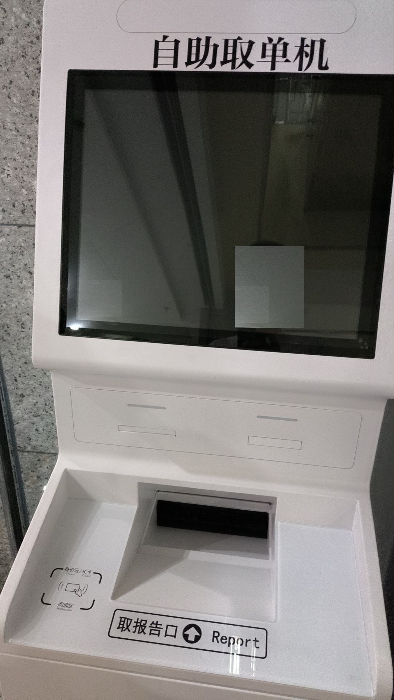
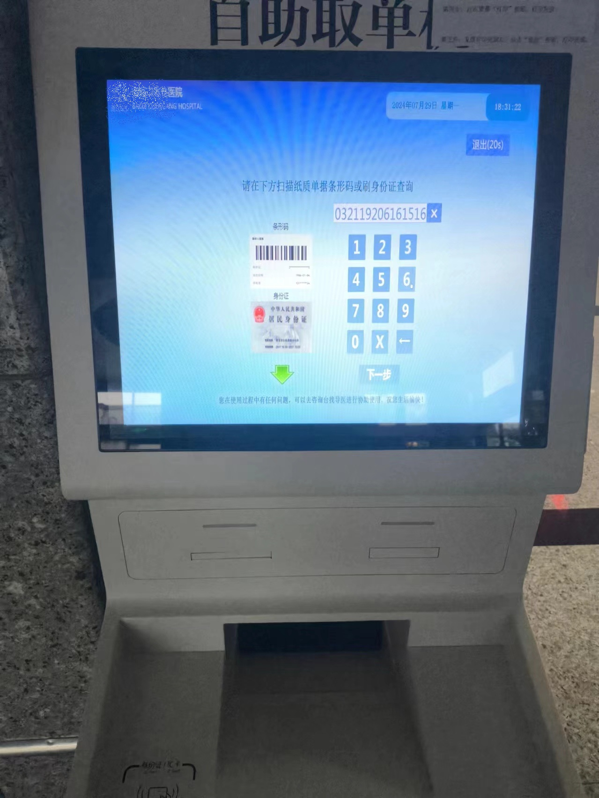
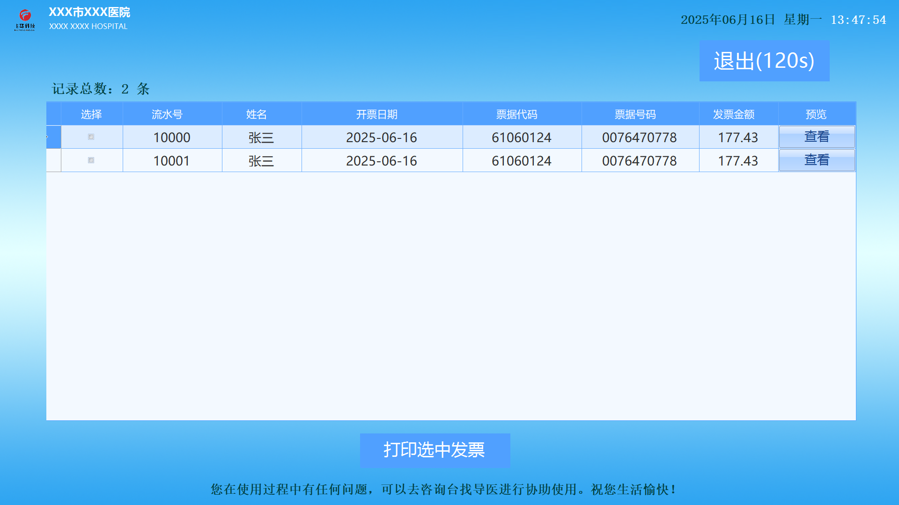
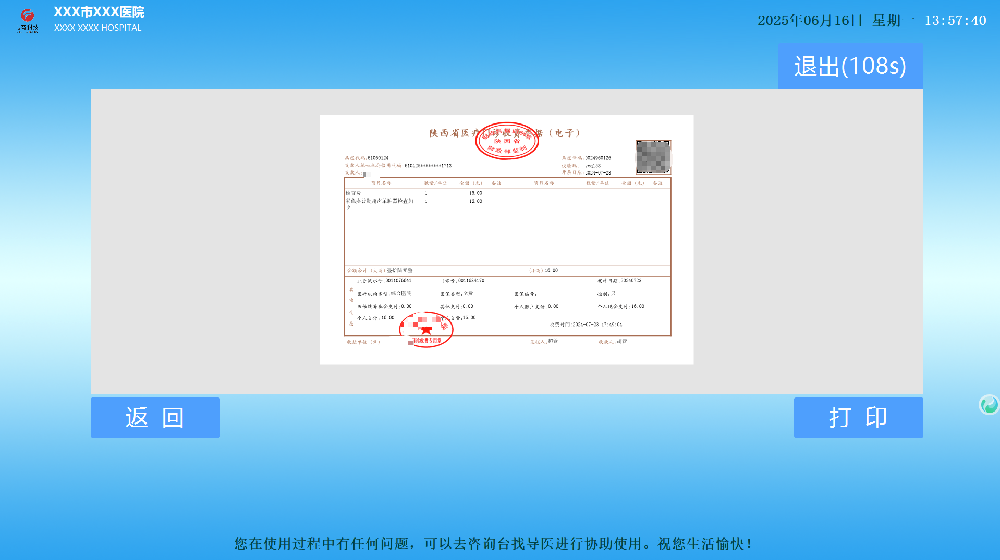
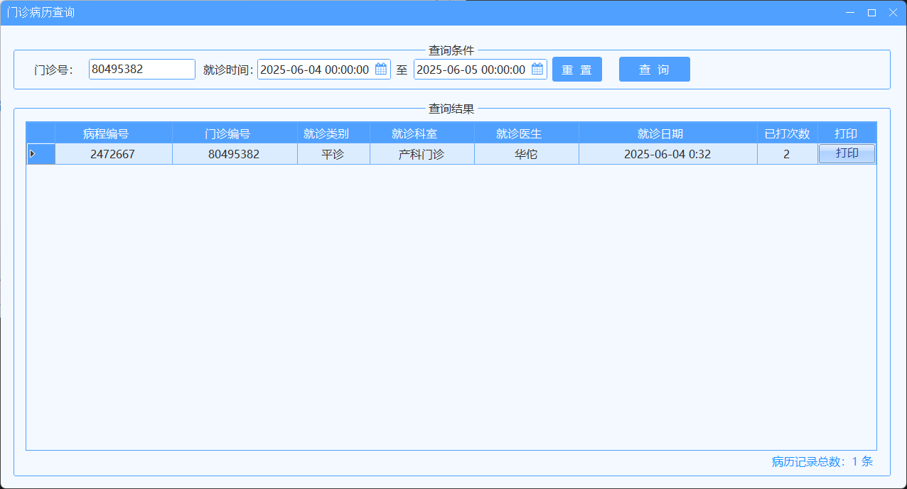
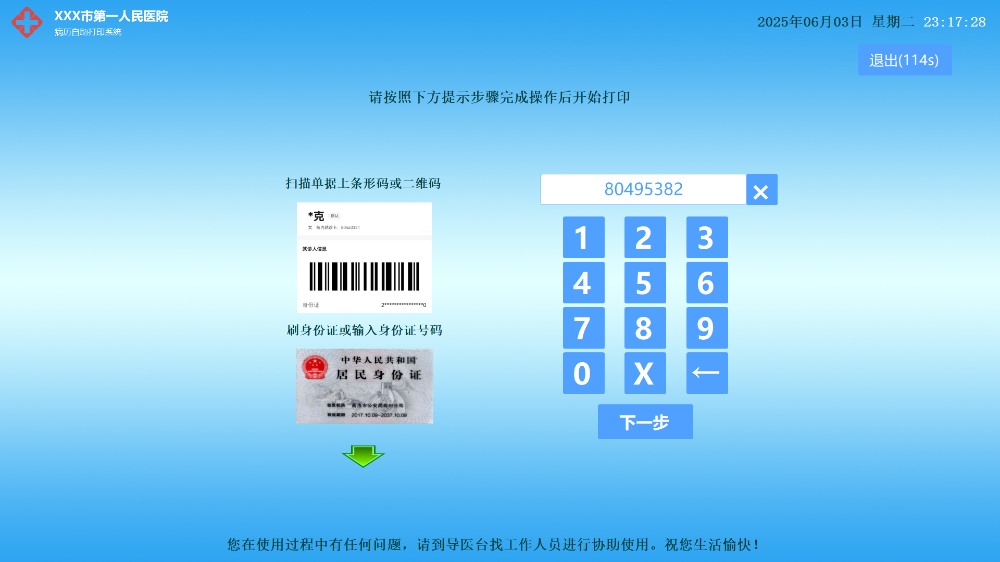
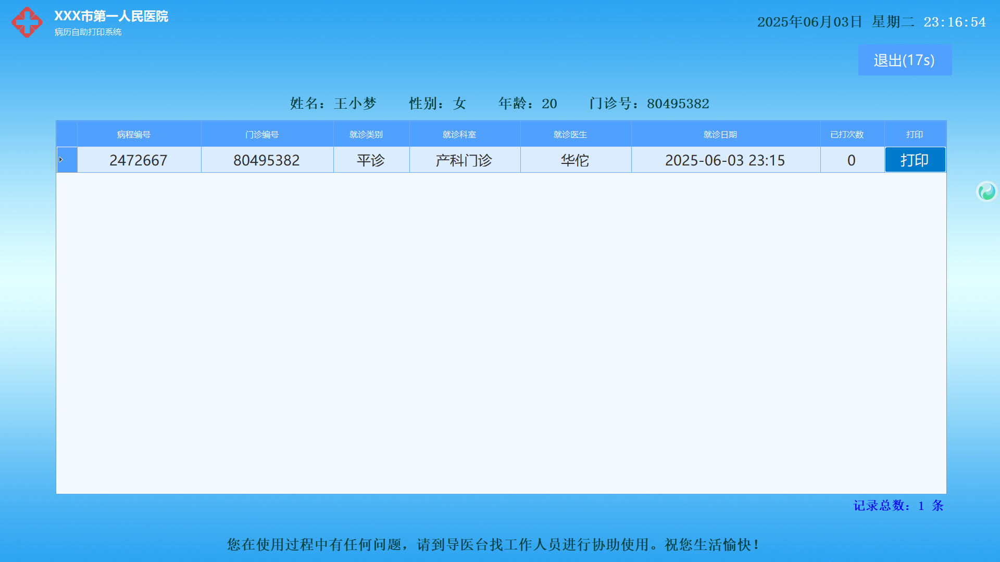
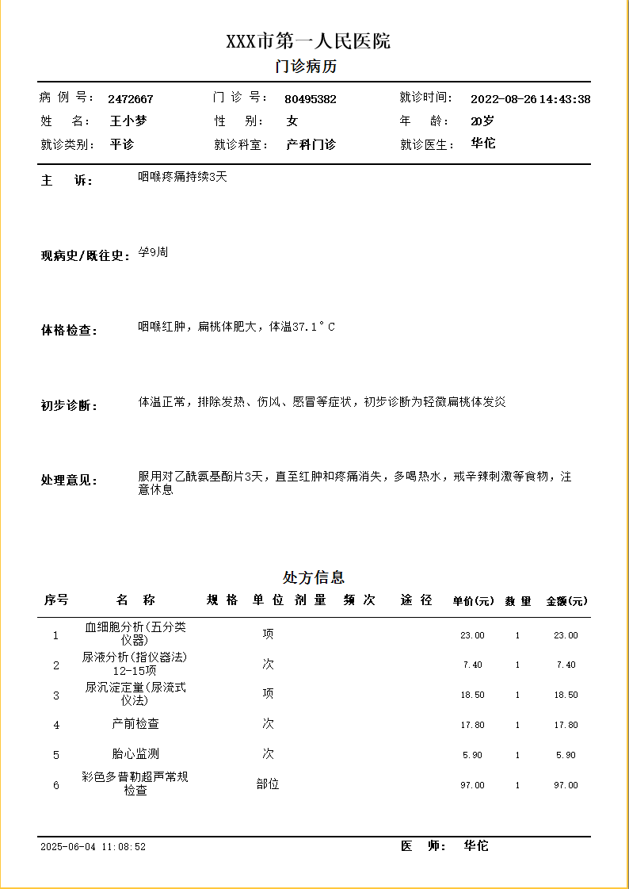

# HospitalMedicalPrinter

#### 介绍
医院自助打印机程序（电子发票、病历、报告、签到、排号等各种医疗单据）

#### 软件架构
使用C#语言基于.NET平台Winform架构开发，支持SQLite、SQLServer等数据库以及各种WebService、WebAPI对接，支持FastReport报表模板自定义打印模板。

#### 安装教程
Windows系统自助机直接安装使用。

#### 使用说明

1.  首页菜单选择；
2.  输入号码（挂号号、门诊号、住院号、身份证号等医疗号码）、刷卡（刷身份证/就诊卡等）或扫描二维码/条码（挂号号、门诊号、住院号、身份证号等医疗号码）点击查询或下一步；
3.  列表展示查询到的数据结果；
4.  选择对应的结果进行查看或其他操作（比如：预览、打印等）；
5.  如操作为打印，在自助机出纸口取走打印单据或报告；

#### 部分案例

##### 电子发票打印

##### 门诊病历打印

#### 定制开发或授权等商务合作

